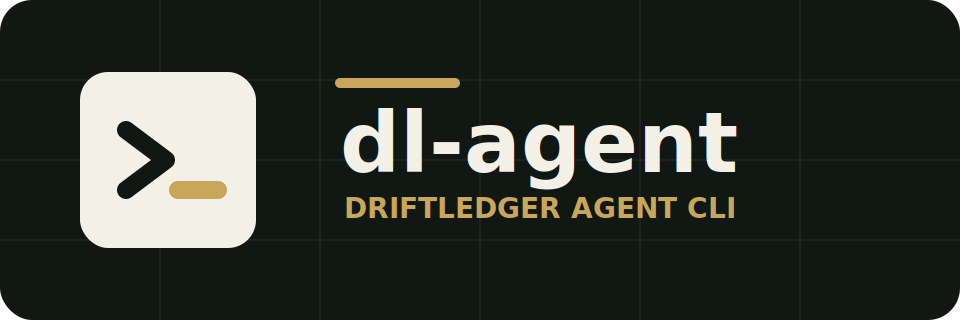

<p align="center">
  
</p>

<h1 align="center">dl-agent</h1>

<p align="center">
  Agent-facing CLI, skills, examples, and synthetic sample assets for DriftLedger.
</p>

<p align="center">
  <a href="https://driftledger-global.fatclaw.com/cli">CLI Guide</a>
  ·
  <a href="docs/workflows.md">Workflows</a>
  ·
  <a href="docs/pipeline.md">Pipeline</a>
  ·
  <a href="docs/input-data.md">Input Data</a>
  ·
  <a href="docs/commands.md">Commands</a>
  ·
  <a href="docs/publishing.md">Publishing</a>
</p>

`dl-agent` helps shell-capable agents use DriftLedger without operating the web
console. It packages the `dl` command, install guidance, reusable agent
instructions, skills, request-body examples, and synthetic demo data.

Use it for the end-to-end reconciliation loop:

```text
install CLI -> authenticate -> download demo or upload CSV/JSONL -> create model
-> train or add rules -> build RuleForest -> run checks -> inspect incidents
-> verify alert delivery
```

## Install

Hosted install:

```bash
curl -fsSL https://driftledger-global.fatclaw.com/install.sh | bash
dl config set --api-url https://driftledger-global.fatclaw.com
dl auth login --email you@example.com --password "<password>"
dl doctor
```

Browser login entrypoint:

```bash
dl auth login --web --web-url https://driftledger-global.fatclaw.com
```

This opens the DriftLedger login page. For headless agents, use API login or
set `DRIFTLEDGER_TOKEN`; the browser flow does not capture a CLI token yet.

Local development install:

```bash
git clone https://github.com/tryanswer/dl-agent.git
cd dl-agent
npm install
npm install -g ./packages/cli
dl config set --api-url http://localhost:8088
dl doctor
```

Use `dl` in docs, scripts, and agent instructions. `driftledger` remains a
compatibility alias for older installs.

## Agent Setup

Generate the instruction file for the agent runtime in the current project:

```bash
dl agent init codex --out AGENTS.md
dl agent init claude --out CLAUDE.md
dl agent init openclaw --out OPENCLAW.md
dl agent init generic --out AGENT.md
```

Hosted or sandboxed agents can avoid local config writes:

```bash
export DRIFTLEDGER_API_URL="https://driftledger-global.fatclaw.com"
export DRIFTLEDGER_TOKEN="<jwt>"
export DRIFTLEDGER_WORKSPACE_ID="Default"
```

Workspace defaults to `Default` when `--workspace`,
`DRIFTLEDGER_WORKSPACE_ID`, and local config are all omitted. Pass
`--workspace <spId>` only when the user explicitly chooses another workspace.

Do not commit tokens, passwords, cookies, raw account numbers, webhook secrets,
or company data into generated agent files.

## Skills

The CLI is the runtime interface. Skills teach agents the preferred workflow.

Codex:

```bash
mkdir -p ~/.codex/skills
cp -R skills/driftledger-cli ~/.codex/skills/
cp -R skills/driftledger-incident-review ~/.codex/skills/
```

Claude Code:

```bash
mkdir -p ~/.claude/skills
cp -R skills/driftledger-cli ~/.claude/skills/
cp -R skills/driftledger-incident-review ~/.claude/skills/
```

Use `skills/driftledger-cli` for install, workspace, metadata, upload, model,
rule, RuleForest, alert, run, and incident commands. Use
`skills/driftledger-incident-review` after a run creates incidents and alert
delivery logs.

## Demo Assets

The npm package does not bundle sample files. Download the public synthetic
merchant-payment-escrow scenario with the CLI:

```bash
dl demo pull
# default root:
# ~/.driftledger/samples/merchant-payment-escrow-reconciliation

dl demo pull --out ./driftledger-demo
```

`dl demo pull` prints JSON with `root`, file status, and ready-to-adapt upload
commands. Use `--force` to refresh files, and `--source-base <url>` or
`DRIFTLEDGER_DEMO_BASE_URL` when an agent needs a mirror.

The scenario is fully synthetic. It models:

```text
merchant_order -> payment_order -> acquiring_transaction
              -> escrow_ledger -> escrow_release
              -> clearing_record -> settlement_record
```

Included data:

| File | Records | Purpose |
| --- | ---: | --- |
| `datasets/train.jsonl` | 160 | Clean assembled records for rule training. |
| `datasets/test.jsonl` | 24 | Clean validation records. |
| `datasets/test-with-anomaly.jsonl` | 4 | Controlled anomaly records for incident verification. |
| `models/demo_model.jsonl` | 1 | Synthetic reconciliation model. |

The anomaly records keep join keys intact and only change checked field values,
so incidents come from business mismatches rather than broken assembly.

## Run a Reconciliation Check

Start with authentication and workspace discovery:

```bash
dl doctor
dl auth verify
dl workspace list
```

Use assembled JSONL when related source rows are already joined:

```bash
dl demo pull
DEMO_ROOT="${DRIFTLEDGER_DEMO_DIR:-$HOME/.driftledger/samples/merchant-payment-escrow-reconciliation}"

dl dataset create-assembled --display-name merchant-payment-escrow
dl dataset upload-assembled --dataset <datasetId> --file "$DEMO_ROOT/datasets/train.jsonl"
dl dataset create-assembled --display-name merchant-payment-escrow-anomaly
dl dataset upload-assembled --dataset <anomalyDatasetId> --file "$DEMO_ROOT/datasets/test-with-anomaly.jsonl"
```

Use raw CSV when DriftLedger should preserve table identity before assembly:

```bash
dl metadata col-types
dl metadata upsert --body-file examples/body-files/meta.json
dl data-source upsert --display-name "Payment Order CSV" --type CSV_UPLOAD
dl source-binding upsert --body-file examples/body-files/binding.json
dl dataset create-raw --display-name payment-order --binding-id <bindingId>
dl dataset upload --dataset <datasetId> --file payment_order.csv
dl assembly submit --body-file examples/body-files/assembly.json
dl assembly run --task <assemblyTaskId>
```

Then create the model, produce executable rules, run checks, and inspect the
closed alert loop:

```bash
dl check-model create --body-file examples/body-files/check-model.json
dl infer-task submit --body-file examples/body-files/infer-task.json
dl infer-task progress --task <inferTaskId>
dl rule types
dl rule validate --body-file examples/body-files/rule.json
dl rule add --body-file examples/body-files/rule.json
dl rule-forest build
dl rule-forest status
dl alerts upsert --body-file examples/body-files/alert-email-channel.json
dl alerts test --channel <channelId>
dl run submit --body-file examples/body-files/run.json
dl run run --task <taskId>
dl incidents task --task <taskId>
dl alerts deliveries --task <taskId>
```

Notes:

- See `docs/pipeline.md` for the full ID handoff between commands.
- See `docs/input-data.md` for assembled JSONL, raw CSV, and body-file formats.
- Field `types` in metadata are optional. If provided, use only values returned
  by `dl metadata col-types`.
- Manual rule payloads must use a `ruleType` returned by `dl rule types`.
- Natural-language rules must be converted from existing metadata fields into
  valid rule DSL, then checked with `dl rule validate` before saving.
- Rule changes should be compiled with `dl rule-forest build` before execution.
- Production runs should configure email or webhook alerts before use.

## Concepts

| Term | Meaning |
| --- | --- |
| Workspace | Isolation boundary for metadata, models, rules, runs, incidents, and one compiled RuleForest. |
| Reconciliation model | Business scenario model that defines relationships and owns rules. CLI group: `check-model`. |
| Assembled data | JSONL records that already join related source rows into reconciliation samples. |
| Raw table data | CSV source-table exports that DriftLedger assembles before checking. |
| RuleForest | Workspace-level compiled rule artifact loaded by execution. |
| Incident | Exception event produced by a run, with rule, evidence rows, and handling state. |
| Alert delivery | Email or webhook delivery log for test alerts and incident notifications. |

## Development

```bash
npm install
npm run check
```

Sample maintenance:

```bash
npm run verify:samples
npm run sync:samples
```

`sync:samples` generates deterministic synthetic records locally. It does not
read company fixtures or sibling repositories.

## More Documentation

- `docs/pipeline.md`: end-to-end command pipeline and ID handoff.
- `docs/input-data.md`: assembled JSONL, raw CSV, body-file, and rule input formats.
- `docs/workflows.md`: assembled-data and raw-table workflow details.
- `docs/commands.md`: command groups, aliases, and backend endpoints.
- `samples/merchant-payment-escrow-reconciliation/README.md`: demo scenario,
  join keys, profiles, and anomaly design.
- `skills/README.md`: skill installation and boundaries.

## Security

See `SECURITY.md`. Public samples must remain synthetic and must not contain
real accounts, order numbers, addresses, webhook secrets, or company exports.

## License

Apache-2.0.
