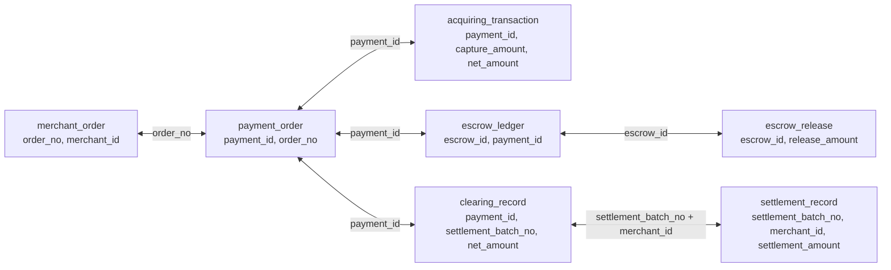

<p align="center">
  
</p>

<h1 align="center">dl-agent</h1>

<p align="center">
  Agent-facing command line tools, instructions, examples, and sample assets for DriftLedger.
</p>

<p align="center">
  <a href="https://driftledger.fatclaw.com/cli">CLI Guide</a>
  ·
  <a href="docs/architecture.md">Architecture</a>
  ·
  <a href="docs/publishing.md">Publishing</a>
</p>

`dl-agent` is the distribution layer that lets shell-capable agents use DriftLedger without screen scraping the web console. It packages the public CLI, install script, agent instruction templates, request body examples, synthetic demo assets, skills, and future MCP assets in one repository.

The first package is `@driftledger/cli`, exposed as both:

- `dl`: short command for agents and day-to-day shell use.
- `driftledger`: long command for compatibility and public documentation.

## What You Can Do

- Install the DriftLedger CLI from a hosted bash script or local checkout.
- Connect Codex, Claude Code, OpenClaw, CI jobs, and generic shell agents.
- Create or select a workspace.
- Upload raw CSV table exports or assembled JSONL reconciliation data.
- Create metadata, source bindings, reconciliation models, rules, and execution tasks.
- Inspect execution result indexes and incidents through JSON output.
- Configure email or webhook alert channels and inspect delivery logs after a run.
- Reuse synthetic demo assets for training, validation, and incident smoke tests.

## Product Vocabulary

Use these names consistently in agent instructions, website copy, command help,
and examples:

| Term | Meaning |
| --- | --- |
| Workspace | Isolation boundary for metadata, data, reconciliation models, rules, runs, incidents, and one compiled RuleForest. |
| Table metadata | Registered source table shape, ownership, risk level, and descriptive context. |
| Field metadata | Registered field shape, type hints, join-key flags, primary-key flags, and risk level. |
| Raw table data | CSV exports that preserve the original source-table identity. |
| Assembled data | JSONL records that already join related source rows into reconciliation samples. |
| Reconciliation model | The configured model for one business scenario. It defines table relationships, assembly scope, and the parent object for rules. The CLI command group is `check-model` for backend compatibility. |
| Rule | Human-reviewed invariant attached to a reconciliation model. Rules may come from training, manual creation, or migration. |
| RuleForest | Workspace-level compiled rule artifact loaded by execution for faster rule evaluation. |
| Incident | Exception event produced by a run, including rule, evidence rows, and handling state. |
| Alert channel | Workspace-level email or webhook route used to notify users when a run opens incidents. |
| Alert delivery | Delivery log for test alerts and incident notifications, optionally filtered by execution task. |

The MVP supports two data paths:

```text
Raw table data -> metadata -> source binding -> assembly -> assembled data -> reconciliation model -> rules -> RuleForest -> alert channel -> run -> incidents -> alert delivery
Assembled data -------------------------------------------------------------------------------> reconciliation model -> rules -> RuleForest -> alert channel -> run -> incidents -> alert delivery
```

## Install

Hosted install:

```bash
curl -fsSL https://driftledger.fatclaw.com/install.sh | bash
dl config set --api-url https://driftledger.fatclaw.com
dl auth login --email you@example.com --password "<password>"
```

npm install:

```bash
npm install -g @driftledger/cli
dl doctor
```

Local development install:

```bash
git clone https://github.com/tryanswer/dl-agent.git
cd dl-agent
npm install
npm install -g ./packages/cli
dl config set --api-url http://localhost:8088
dl doctor
```

## Agent Setup

Generate the instruction file for the agent runtime in the current project:

```bash
dl agent init codex --out AGENTS.md
dl agent init claude --out CLAUDE.md
dl agent init openclaw --out OPENCLAW.md
dl agent init generic --out AGENT.md
```

Hosted or sandboxed agents can avoid local config writes:

```bash
export DRIFTLEDGER_API_URL="https://driftledger.fatclaw.com"
export DRIFTLEDGER_TOKEN="<jwt>"
export DRIFTLEDGER_WORKSPACE_ID="Default"
```

Configuration precedence is:

```text
CLI flags > environment variables > ~/.driftledger/config.json > Default
```

If no workspace is provided by `--workspace`, `DRIFTLEDGER_WORKSPACE_ID`, or
local config, `dl` uses `Default`. Pass `--workspace <spId>` only when an agent
should operate outside the default workspace.

## Skill Setup

The CLI is the runtime interface. Skills are optional workflow packages that
teach an agent how to use the CLI without rediscovering the sequence each time.

Install the DriftLedger skills for Codex:

```bash
mkdir -p ~/.codex/skills
cp -R skills/driftledger-cli ~/.codex/skills/
cp -R skills/driftledger-incident-review ~/.codex/skills/
```

Install the same skills for Claude Code:

```bash
mkdir -p ~/.claude/skills
cp -R skills/driftledger-cli ~/.claude/skills/
cp -R skills/driftledger-incident-review ~/.claude/skills/
```

For OpenClaw or a generic shell agent, keep the skills in the repository and
generate a project instruction file:

```bash
dl agent init openclaw --out OPENCLAW.md
dl agent init generic --out AGENT.md
```

Use `skills/driftledger-cli` for installation, workspace, metadata, data,
model, rule, RuleForest, alert, run, and incident commands. Use
`skills/driftledger-incident-review` after a run creates incidents and delivery
logs.

## How To Use DriftLedger With An Agent

This is the recommended step-by-step sequence for Codex, Claude Code, OpenClaw,
CI, and other shell-capable agents.

### 1. Install and verify the CLI

```bash
command -v dl >/dev/null || npm install -g @driftledger/cli
dl doctor
```

For local development from this repository:

```bash
npm install
npm install -g ./packages/cli
dl config set --api-url http://localhost:8088
dl doctor
```

### 2. Configure API, authentication, and optional workspace override

```bash
dl config set --api-url https://driftledger.fatclaw.com
dl auth login --email you@example.com --password "<password>"
dl auth verify
dl workspace list
dl workspace create --name "Default"
```

`Default` is used automatically when no workspace is specified. Use
`dl workspace activate --workspace <spId>` or `--workspace <spId>` only when the
user chooses a different workspace.

Hosted agents can use environment variables instead of local config:

```bash
export DRIFTLEDGER_API_URL="https://driftledger.fatclaw.com"
export DRIFTLEDGER_TOKEN="<jwt>"
export DRIFTLEDGER_WORKSPACE_ID="Default"
```

### 3. Generate the agent instruction file

```bash
dl agent init codex --out AGENTS.md
dl agent init claude --out CLAUDE.md
dl agent init openclaw --out OPENCLAW.md
dl agent init generic --out AGENT.md
```

Commit the instruction file only after confirming it contains no tokens,
passwords, cookies, raw account numbers, webhook secrets, or company data.

### 4. Choose the data path

Use the assembled-data path when another job has already produced joined JSONL:

```bash
dl dataset create-assembled --display-name merchant-payment-escrow
dl dataset upload-assembled --dataset <datasetId> --file samples/merchant-payment-escrow-reconciliation/datasets/train.jsonl
```

Use the raw-table path when the user uploads CSV exports and DriftLedger should
preserve table identity before assembly:

```bash
dl metadata upsert --body-file examples/body-files/meta.json
dl data-source upsert --display-name "Payment Order CSV" --type CSV_UPLOAD
dl source-binding upsert --body-file examples/body-files/binding.json
dl dataset create-raw --display-name payment-order --binding-id <bindingId>
dl dataset upload --dataset <datasetId> --file payment_order.csv
dl assembly submit --body-file examples/body-files/assembly.json
dl assembly run --task <assemblyTaskId>
```

### 5. Create the reconciliation model

The reconciliation model defines table relationships, assembly scope, and the
parent object for rules.

```bash
dl check-model create --body-file examples/body-files/check-model.json
dl check-model deploy --id <riskModelId>
dl check-model enable --id <riskModelId>
```

### 6. Train or add rules

Use training when sample data is available:

```bash
dl infer-task submit --body-file examples/body-files/infer-task.json
dl infer-task progress --task <inferTaskId>
```

Add a reviewed rule before execution:

```bash
dl rule add --body-file examples/body-files/rule.json
dl rule list
```

### 7. Build RuleForest

Rule changes should be compiled into the workspace RuleForest before execution.

```bash
dl rule-forest build
dl rule-forest status
```

### 8. Configure alert delivery

MVP runs should have at least one alert channel before production execution.

```bash
dl alerts upsert --body-file examples/body-files/alert-email-channel.json
dl alerts upsert --body-file examples/body-files/alert-webhook-channel.json
dl alerts list
dl alerts test --channel <channelId>
```

### 9. Run checks and inspect incidents

```bash
dl run submit --body-file examples/body-files/run.json
dl run run --task <taskId>
dl run indexes --task <taskId>
dl incidents task --task <taskId>
dl alerts deliveries --task <taskId>
```

### 10. Review and hand off

Use `skills/driftledger-incident-review` to summarize rule failures, evidence
rows, alert delivery state, owner, likely cause, and next action without exposing
raw company identifiers.

## MVP Workflow

Start with workspace and authentication:

```bash
dl doctor
dl auth verify
dl workspace list
# Default is used automatically when no workspace is specified.
# Override only when operating outside Default:
dl config set --workspace <spId>
```

The commands below use the bundled merchant-payment-escrow reconciliation demo. It is
the fastest path for an agent to prove the complete DriftLedger flow: upload
assembled data, create a reconciliation model, add rules, execute validation, and
inspect incidents.

Use the assembled-data path when another job already produced joined reconciliation rows:

```bash
dl dataset create-assembled --display-name merchant-payment-escrow
dl dataset upload-assembled --dataset <datasetId> --file samples/merchant-payment-escrow-reconciliation/datasets/train.jsonl
dl dataset create-assembled --display-name merchant-payment-escrow-anomaly
dl dataset upload-assembled --dataset <anomalyDatasetId> --file samples/merchant-payment-escrow-reconciliation/datasets/test-with-anomaly.jsonl
dl check-model create --body-file examples/body-files/check-model.json
# Replace <riskModelCode>, <riskModelVersion>, <riskModelId>, <trainingAssembledDatasetId>,
# and <anomalyAssembledDatasetId>
# in examples/body-files/*.json with the IDs returned by the previous commands.
dl infer-task submit --body-file examples/body-files/infer-task.json
dl infer-task progress --task <inferTaskId>
dl rule add --body-file examples/body-files/rule.json
dl rule-forest build
dl rule-forest status
dl alerts upsert --body-file examples/body-files/alert-email-channel.json
dl alerts test --channel <channelId>
dl run submit --body-file examples/body-files/run.json
dl run run --task <taskId>
dl incidents task --task <taskId>
dl alerts deliveries --task <taskId>
```

Use the raw-table path when DriftLedger should preserve source-table identity before assembly:

```bash
dl metadata upsert --body-file examples/body-files/meta.json
dl data-source upsert --display-name "Payment Order CSV" --type CSV_UPLOAD
dl source-binding upsert --body-file examples/body-files/binding.json
dl dataset create-raw --display-name payment-order --binding-id <bindingId>
dl dataset upload --dataset <datasetId> --file payment_order.csv
dl assembly submit --body-file examples/body-files/assembly.json
dl assembly run --task <assemblyTaskId>
```

## Demo Scenario

`samples/merchant-payment-escrow-reconciliation` is fully synthetic and models a
merchant order paid through an acquiring flow, held in escrow, released after
buyer confirmation, cleared, and settled to the merchant. DriftLedger assembles
those source rows into one reconciliation record and checks that linkage keys,
success statuses, fees, and money amounts remain consistent.



Model identity:

- Sample asset model ID: `DL_SYNTH_MERCHANT_ESCROW_001`
- Sample asset version: `synthetic-v1`
- Backend risk model code: returned by `dl check-model create`; use it as
  `<riskModelCode>` in rule payloads.
- Trigger table: `driftledger.payment_order`
- Trigger filter: `driftledger.payment_order.payment_status == 'PAID'`
- Data shape: assembled JSONL records with `tableDataMap` entries for all joined tables.

Data split:

| File | Records | Purpose |
| --- | ---: | --- |
| `datasets/train.jsonl` | 48 | Clean assembled records for rule training. |
| `datasets/test.jsonl` | 12 | Clean validation set. |
| `datasets/test-with-anomaly.jsonl` | 12 | Validation set with one controlled amount mismatch. |

The anomaly fixture keeps all join keys intact and changes only
`driftledger.settlement_record#settlement_amount` by `1.00` CNY so it no longer
matches `driftledger.clearing_record#net_amount`. This should produce an
incident when the settlement consistency rule is active.

## Generated Rule Candidates

These representative rules are the demo rules an agent should create or expect
from training on this fixture:

| Rule | What it protects |
| --- | --- |
| `driftledger.payment_order#payment_amount = driftledger.acquiring_transaction#capture_amount WHERE driftledger.payment_order#payment_status = 'PAID'` | A paid order must be captured for the same amount. |
| `driftledger.payment_order#payment_amount = driftledger.escrow_ledger#escrow_amount WHERE driftledger.escrow_ledger#escrow_status = 'HELD'` | The escrow hold must match the paid amount. |
| `driftledger.escrow_ledger#escrow_amount = driftledger.escrow_release#release_amount WHERE driftledger.escrow_release#release_status = 'RELEASED'` | Buyer-confirmed release must release the held amount. |
| `driftledger.payment_order#net_amount = driftledger.clearing_record#net_amount WHERE driftledger.clearing_record#clearing_status = 'CLEARED'` | Clearing net amount must reflect payment amount minus fee. |
| `driftledger.clearing_record#net_amount = driftledger.settlement_record#settlement_amount WHERE driftledger.clearing_record#clearing_status = 'CLEARED'` | Merchant settlement must pay the cleared net amount. |

The checked-in `examples/body-files/rule.json` uses the settlement rule because
`datasets/test-with-anomaly.jsonl` is built to fail it deterministically.

## Sample Assets

Sanitized demo assets live under:

```text
samples/merchant-payment-escrow-reconciliation
```

Files:

- `datasets/train.jsonl`: clean assembled records for rule training.
- `datasets/test.jsonl`: clean assembled records for validation.
- `datasets/test-with-anomaly.jsonl`: controlled amount mismatch for incident verification.
- `models/demo_model.jsonl`: synthetic reconciliation model for the same scenario.
- `manifest.json`: fixture metadata, scenario name, counts, and privacy notes.
- `README.md`: dataset-local scenario notes and privacy guard details.

Privacy guard:

```bash
npm run verify:samples
```

Regenerate deterministic synthetic samples:

```bash
npm run sync:samples
```

`sync:samples` generates the records locally and writes to `samples/merchant-payment-escrow-reconciliation`; it does not read company fixtures or sibling repositories.

## Repository Layout

The repository is organized by distribution surface. Keep CLI runtime code,
agent instructions, workflow docs, request bodies, synthetic samples, release
scripts, skill packages, and future MCP wrappers in separate directories so
agents can update one surface without touching the others.

```text
dl-agent/
  package.json                   npm workspace scripts, package metadata, and Node.js engine contract
  package-lock.json              reproducible dependency lockfile
  .env.example                   local CLI/API configuration example, no secrets
  .editorconfig                  editor defaults for portable formatting
  .gitignore                     generated files and local environment exclusions
  .github/
    workflows/ci.yml             CI for CLI tests and sample privacy guard
    ISSUE_TEMPLATE/              bug and feature templates
      bug_report.md
      feature_request.md
    pull_request_template.md      PR checklist
  agents/
    AGENTS.md                    Codex instruction contract
    CLAUDE.md                    Claude Code instruction contract
    OPENCLAW.md                  OpenClaw instruction contract
    AGENT.md                     generic shell-agent instruction contract
  assets/
    logo.svg                     README and website brand asset
  docs/
    architecture.md              maintainer architecture notes
    commands.md                  command groups, aliases, and backend endpoints
    publishing.md                npm, install-script, and GitHub release notes
    workflows.md                 raw-table and assembled-data MVP flows
  examples/
    body-files/
      meta.json                  table and field metadata request body
      binding.json               source-column binding request body
      assembly.json              raw-table assembly task request body
      check-model.json           reconciliation model request body
      infer-task.json            rule training task request body
      rule.json                  confirmed rule request body
      run.json                   execution task request body
      alert-email-channel.json   email notification channel request body
      alert-webhook-channel.json webhook notification channel request body
  packages/
    cli/                         npm package published as @driftledger/cli
      package.json               package name, binary aliases, scripts, and publish metadata
      bin/driftledger.js         executable entrypoint
      src/cli.js                 command execution and HTTP transport
      src/core.js                argument parsing, config precedence, endpoint mapping
      test/core.test.js          CLI contract tests
      README.md                  package-level usage notes
  scripts/
    install.sh                   hosted install script
    sync-demo-assets.mjs         generate deterministic synthetic demo assets
    verify-demo-assets.mjs       privacy guard for sample assets
    README.md                    script-specific maintenance notes
  samples/
    merchant-payment-escrow-reconciliation/
      README.md                  scenario notes and privacy guard explanation
      datasets/
        train.jsonl              clean assembled records for training
        test.jsonl               clean assembled records for validation
        test-with-anomaly.jsonl  validation records with one controlled mismatch
      models/
        demo_model.jsonl         synthetic reconciliation model
      manifest.json              sample metadata and privacy notes
  skills/
    README.md                    DriftLedger skill packaging surface
    driftledger-cli/             CLI-first workflow skill package
      SKILL.md                   install, auth, workspace, metadata, alerts, run workflow
      examples/                  reusable command transcripts and body files
      scripts/                   optional validators or setup helpers
    driftledger-incident-review/ incident triage and remediation skill package
      SKILL.md                   incident summarization, alert delivery, and remediation workflow
      templates/                 report and handoff templates
  mcp/                           future MCP server packaging surface
    README.md                    MCP transport and tool contract notes
  CHANGELOG.md                   release history
  CODE_OF_CONDUCT.md             contributor behavior expectations
  CONTRIBUTING.md                contribution workflow
  LICENSE                        Apache-2.0 license text
  SECURITY.md                    security reporting and data handling guidance
```

Directory responsibilities:

| Directory | Owner surface | Change when |
| --- | --- | --- |
| `packages/cli` | `dl` / `driftledger` command runtime | Adding commands, changing config precedence, or updating API mappings. |
| `agents` | Codex, Claude Code, OpenClaw, and generic agent instruction presets | Changing how agents should call the CLI or handle secrets. |
| `examples/body-files` | Reviewable JSON payload templates | Backend request contracts change, or the MVP workflow needs a new request body. |
| `samples/merchant-payment-escrow-reconciliation` | Synthetic model, train/test data, and anomaly fixture | Refreshing demo data, model structure, or privacy guard metadata. |
| `scripts` | Install, synthetic sample generation, and privacy verification automation | Publishing install scripts or regenerating public samples. |
| `skills` | Agent skill packages | Packaging DriftLedger workflows as reusable Codex/Claude/OpenClaw skills. |
| `mcp` | Future MCP server or manifest packages | Exposing DriftLedger atoms as MCP tools instead of shell commands. |
| `docs` | Maintainer architecture and publishing notes | Explaining package boundaries, release steps, or operational decisions. |

Placeholder directories such as `skills/driftledger-cli` and `mcp` are committed
early so future work has a stable target instead of adding ad-hoc top-level
folders.

## Extension Points

Add new surfaces in the narrowest directory that owns the change:

| Need | Put it in |
| --- | --- |
| A new backend atom exposed to agents | `packages/cli/src/core.js`, `packages/cli/src/cli.js`, and `packages/cli/test/core.test.js` |
| A reusable request body | `examples/body-files` |
| A new sample scenario | `samples/<semantic-scenario-name>` |
| A privacy or data-shape guard | `scripts/verify-*.mjs` plus CI |
| A Codex/Claude/OpenClaw instruction template | `agents` now, then `skills/<skill-name>` when packaged |
| A future MCP transport | `mcp` |

## Documentation Map

- Start here when installing or validating the full agent workflow: `README.md`.
- Use `packages/cli/README.md` for package-level CLI usage.
- Use `docs/architecture.md` to understand package boundaries and command contracts.
- Use `docs/commands.md` to inspect command groups, aliases, and backend endpoints.
- Use `docs/workflows.md` for raw-table and assembled-data MVP flows.
- Use `docs/publishing.md` before publishing the npm package or hosted install script.
- Use `samples/merchant-payment-escrow-reconciliation/README.md` to understand the demo data, model, and anomaly fixture.
- Use `scripts/README.md` when changing install, sync, or privacy verification scripts.
- Use `skills/README.md` for Codex/Claude/OpenClaw workflow packaging boundaries.

## Command Surface

Core commands:

```bash
dl doctor
dl version
dl config get
dl config set --api-url <url> --token <jwt>
dl config set --workspace <spId>
dl auth login --email <email> --password <password>
dl auth verify
dl auth refresh
```

Workspace, metadata, and data:

```bash
dl workspace list
dl workspace create --name "Default"
dl metadata upsert --body-file meta.json
dl data-source upsert --display-name "Payment Order CSV" --type CSV_UPLOAD
dl source-binding upsert --body-file binding.json
dl dataset create-raw --display-name payment-order --binding-id <bindingId>
dl dataset upload --dataset <datasetId> --file payment_order.csv
dl assembly submit --body-file assembly.json
dl assembly run --task <assemblyTaskId>
dl dataset create-assembled --display-name assembled
dl dataset upload-assembled --dataset <datasetId> --file assembled.jsonl
```

Models, rules, runs, and incidents:

```bash
dl check-model create --body-file check-model.json
dl check-model deploy --id <riskModelId>
dl check-model enable --id <riskModelId>
dl infer-task submit --body-file infer-task.json
dl infer-task status --task <inferTaskId>
dl infer-task progress --task <inferTaskId>
dl rule add --body-file rule.json
dl rule list
dl rule-forest build
dl rule-forest status
dl run submit --body-file run.json
dl run run --task <taskId>
dl run indexes --task <taskId>
dl incidents list
dl incidents task --task <taskId>
```

Alerts and delivery logs:

```bash
dl alerts upsert --body-file examples/body-files/alert-email-channel.json
dl alerts upsert --body-file examples/body-files/alert-webhook-channel.json
dl alerts list
dl alerts enable --channel <channelId>
dl alerts disable --channel <channelId>
dl alerts test --channel <channelId>
dl alerts deliveries
dl alerts deliveries --task <taskId>
```

## CLI Contract

- Normal command responses are JSON on stdout.
- Errors are structured JSON on stderr with `ok:false`.
- Complex payloads should be stored in files and passed through `--body-file`.
- Tokens should be provided through `DRIFTLEDGER_TOKEN` or local config, not prompts.
- The MVP supports CSV for raw table uploads and JSONL for assembled reconciliation data.

## Development

```bash
npm install
npm test
npm run verify:samples
npm run check
npm run cli -- doctor
```

Run the CLI package tests directly:

```bash
npm --workspace @driftledger/cli test
```

## Publishing

Dry-run package publication:

```bash
npm run check
npm --workspace @driftledger/cli pack --dry-run
```

The hosted installer should be served at:

```text
https://driftledger.fatclaw.com/install.sh
```

## Security

- Do not commit tokens, passwords, cookies, or raw company datasets.
- Do not commit real alert recipients, webhook URLs, or webhook secrets.
- Run `npm run verify:samples` before publishing sample changes.
- Keep user credentials out of generated agent instruction files.
- Prefer environment variables for CI and hosted agents.

## License

Apache-2.0
